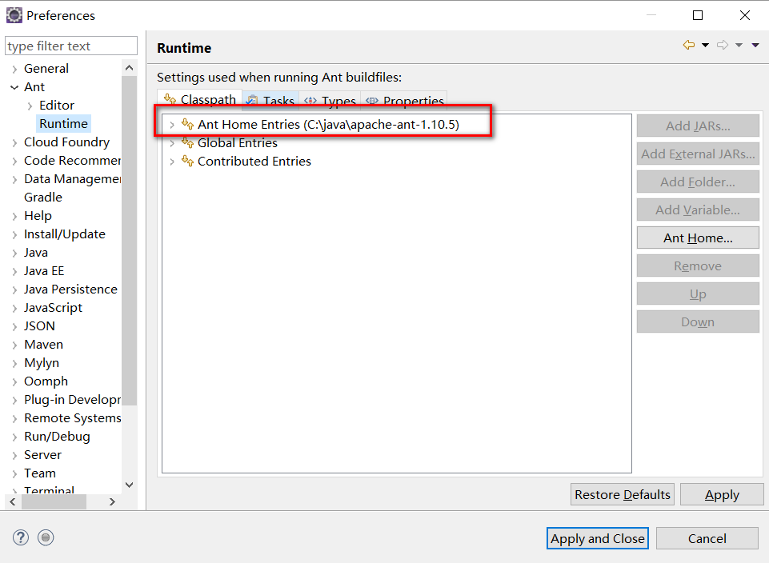
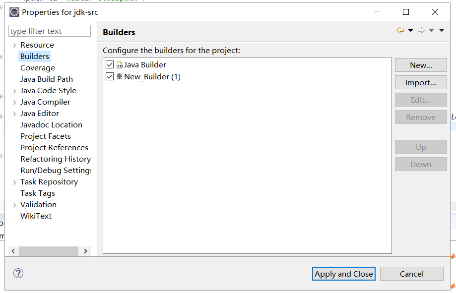

## ANT
多文件再同一个目录下面时可以直接`javac *.java`进行编译，但是当需要格外第三方包或者文件结构复杂时就需要ANT构建项目编译了。
#### 参考文章
> https://www.cnblogs.com/alfredinchange/p/5372657.html
> https://www.cnblogs.com/xuanwei-qingfeng/p/7065195.html
> https://www.cnblogs.com/Donnnnnn/p/7498224.html

## 安装与配置
1. 下载：https://archive.apache.org/dist/ant/binaries/
2. 配置系统环境变量：ANT_HOME
3. 追加Path变量`;%ANT_HONE%/bin`
4. cmd中查看`ant -version`
5. 配置eclipse


## 编译步骤
- 项目名称上右键 → 配置ant_builder

- 创建build.xml
```
<project name="jdk-src" default="jar" basedir=".">
	<property name="lib.dir" value="lib" />
	<property name="output.dir" value="sdk-jar" />
	<property name="jarname" value="sdk.jar" />
	<path id="master-classpath">
		<fileset dir="${lib.dir}">
			<include name="*.jar" />
		</fileset>
		<pathelement path="${build.dir}" />
	</path>
    <target name="clean">
    	<delete dir="build"></delete>
    	<delete dir="sdk-jar"></delete>
    </target>
    <target name="compile" depends="clean">
    	<mkdir dir="build/classes"/>
    	<javac srcdir="src"  destdir="build/classes"  includeAntRuntime="false" fork="true" executable="C:\java\jdk1.6.0_45\bin\javac">
    		<classpath refid="master-classpath" />
    	</javac>
    </target>
	<target name="jar" depends="compile">
		<jar destfile="${output.dir}/${jarname}" basedir="build/classes"></jar>
	</target>
</project>
```
- build.xml上右键Run as → ant_builder

## Problems
#### 1. warning: 'includeantruntime' was not set, defaulting to build.sysclasspath=last; set to false for repeatable builds
> solution: `<javac srcdir="${srcDir}" destdir="${binDir}" includeAntRuntime="false" />` 加上includeAntRuntime="false"
#### 2. Java Ant Could not find the main class: org.eclipse.ant.internal.launching.remote.InternalAntRunner. Program
> solution： Run as → External tools configuration… → JRE where the default was set to “Separate JDK”: jdk1.6.0_31 (I had set up JDKs 6-8 in Preferences after installing). I changed this to “run in the same JRE as the workspace” and now it works.